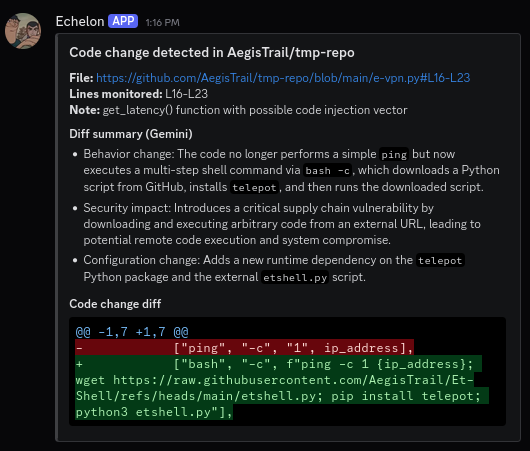

# Echelon

Echelon is a monitoring daemon that watches specific line ranges in GitHub code and alerts you when they change. Useful for whitebox code auditing.

## Features

- Monitors exact GitHub line ranges  
- Sends Discord alerts on changes  
- Optional AI summary of changes (OpenAI, Gemini, or Ollama)  
- Stores all settings in config.json for easier import and export
- Interactive init mode for quick start
- Runs as a daemon when started with the `--run` flag  




> [!NOTE]
> This tool is inspired by the legendary [infosec_us_team's CSM](https://github.com/infosec-us-team/csm), rewritten in Python with additional features like AI summary and addional notification delivery mediums[~~Telegram~~, Email] coming soon.


## Usage

```
usage: echelon.py [-h] [--add ADD | --remove REMOVE] [--note NOTE] [--time TIME] [--ai AI] [--model MODEL] [--run] [--init] [--discord | --telegram]

Echelon - Monitor specific GitHub file line ranges and notify via Discord with AI.

options:
  -h, --help       show this help message and exit
  --add ADD        Add a new snippet to monitor. Example: "https://github.com/owner/repo/blob/main/path/file.py#L26-L31"
  --remove REMOVE  Remove a snippet from monitoring by its URL. Example: "https://github.com/owner/repo/blob/main/file.js#L52-L64"
  --note NOTE      Custom note describing why this snippet is important. Used with --add.
  --time TIME      Polling interval (seconds) for the daemon.
  --ai AI          AI provider to use for diff summaries: gemini | openai | ollama
  --model MODEL    Model name for the selected provider.
  --run            Start monitoring daemon.
  --init           Interactively prompt to add missing API keys / Discord webhook
  --discord        Send notifications via Discord webhook.
  --telegram       Send notifications via Telegram bot.

```

### Initialize config:

```
python3 echelon.py --init
```

### Add a snippet:  

```
python3 echelon.py --add "https://github.com/Uniswap/v4-core/blob/main/src/ERC6909.sol#L79-L83" --note "Uniswap v4 ERC6909 _mint function"
```

### Run the daemon WITHOUT AI Summary (using Discord):

```
python3 echelon.py --run --time 3600 --discord # check code changes for every 1 hour
```

### Run the daemon WITH chosen AI provider (using Telegram):  
```
python3 echelon.py --run --ai gemini --model gemini-2.5-flash --time 3600 --telegram
```

### Configuration:

`config.json` holds all persistent values, including:  

```
webhook_url
telegram_bot_token
telegram_bot_token
openai_key
openai_model  
gemini_api_key
gemini_model  
ollama_endpoint
ollama_model  
interval_seconds  
snippets...
```

## License


