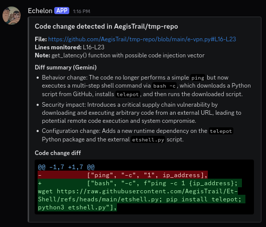

# Echelon

     

Echelon is a monitoring daemon that watches specific line ranges in code hosted on any git provider and alerts you when they change. Useful for whitebox code auditing.

## Features

- **Any git provider**: GitHub (+Enterprise), GitLab (incl. self-hosted + subgroups), Gitea/Codeberg, Bitbucket, SourceHut, plus plain-text raw URLs, auto-detected from the URL
- Slash-safe branches: `feature/x` style branches resolved at `--add` time by probing longest-first
- Drift-resistant line-range monitoring (literal/regex **anchors** + fuzzy re-alignment, so inserts above no longer cause false alerts)
- Provider tokens: private repos, higher rate limits, culprit-**commit enrichment** in every alert (`ETag` conditional fetches on GitHub)
- Fan-out notifications: **Discord, Telegram, Slack, Email (SMTP), generic JSON webhook**: pick any combo with `--notify`
- Optional AI summaries (OpenAI, Gemini, or Ollama)
- SQLite **audit history** (`--log`) + per-snippet enable/disable, notes, intervals
- Secrets-safe: `config.json` is git-ignored + `0600`, env-var overrides (`ECHELON_*`), masked output, `--check-secrets` scanner
- Validated config schema with clear errors; `--list/--check/--export/--import`



> [!NOTE]
> Inspired by the legendary [infosec_us_team's CSM](https://github.com/infosec-us-team/csm), rewritten in Python with AI summaries and extra notification channels.

## Install (uv, recommended)

Requires Python >= 3.12 and [uv](https://docs.astral.sh/uv/).

```bash
# As an isolated CLI tool straight from git:
uv tool install git+https://github.com/AegisTrail/Echelon

# Then run from anywhere:
echelon --help

# Upgrade later:
uv tool upgrade echelon
```

From source:

```bash
git clone https://github.com/AegisTrail/Echelon && cd Echelon
uv sync --group dev        # install deps + test/lint tools
uv run echelon --help      # run without installing
uv run pytest              # tests
uv run ruff check .        # lint
```

> `pip` also works (`pip install git+https://github.com/AegisTrail/Echelon`), but `uv` is the supported path.

## Binary releases

No Python needed: download `echelon-<version>-<os>-<arch>` from
[GitHub Releases](https://github.com/AegisTrail/Echelon/releases), verify
against `SHA256SUMS.txt`, and run it directly.

```bash
chmod +x echelon-v0.3.0-linux-x86_64
./echelon-v0.3.0-linux-x86_64 --version
```

Notes:

- macOS binaries are unsigned: on first run, macOS may block the file.
  Right-click -> Open, or run `xattr -d com.apple.quarantine <file>`.
- Windows may show a SmartScreen prompt for the unsigned `.exe`.
- Releases are cut from tags (`git tag vX.Y.Z`), built with `uv` +
  PyInstaller on Linux/macOS/Windows, and only published if ruff, pytest,
  and the tag-vs-version check all pass.

## Quick start

```bash
echelon --init   # interactive setup; secrets hidden, file saved with mode 0600
echelon --add "https://github.com/Uniswap/v4-core/blob/main/src/ERC6909.sol#L79-L83" --note "ERC6909 _mint" --anchor "_mint"
echelon --add "https://gitlab.com/group/sub/repo/-/blob/main/src/lib.py#L10-L20" --note "auth check"
echelon --add "https://codeberg.org/owner/repo/src/branch/main/main.py#L1-L15"
echelon --list
echelon --check --notify discord --no-notify   # dry-run single pass (cron-friendly)
echelon --run --notify discord --notify telegram --time 3600
echelon --run --ai gemini --model gemini-2.5-flash --notify telegram
```

Supported URL shapes (all need a `#Lx-Ly` fragment; Bitbucket uses `#lines-x:y`):

| Provider | Example |
|---|---|
| GitHub | `https://github.com/<owner>/<repo>/blob/<branch>/<path>#L1-L5` |
| GitHub Enterprise | `https://<ghe-host>/<owner>/<repo>/blob/<branch>/<path>#L1-L5` |
| GitLab | `https://<host>/<group>/.../<repo>/-/blob/<branch>/<path>#L1-5` |
| Gitea/Codeberg | `https://<host>/<owner>/<repo>/src/branch/<branch>/<path>#L1-L5` |
| Bitbucket | `https://bitbucket.org/<owner>/<repo>/src/<branch>/<path>#lines-1:5` |
| SourceHut | `https://<host>/~<user>/<repo>/tree/<branch>/item/<path>#L1-5` |
| Raw text | `https://<host>/<path>#L1-L5` (plain-text body) |

More:

```bash
echelon --add <url> --anchor "def _mint" --context 3     # drift-resistant tracking
echelon --add <url> --anchor-regex "function\s+mint" --snippet-interval 60
echelon --disable <url> | echelon --enable <url>
echelon --set-note <url> --note "why this matters"
echelon --log [url] --limit 20 [--json]                  # audit history
echelon --export backup.json                             # secrets stripped
echelon --export full.json --include-secrets             # careful: chmod 0600
echelon --import backup.json
echelon --set-token github    # or: gitlab | gitea | bitbucket (prompted securely)
echelon --check-secrets                                  # scan tracked files
```

## Configuration

Resolved as: `--config PATH` > `$ECHELON_CONFIG` > `./config.json` > `~/.config/echelon/config.json`.
See `config.example.json` and `.env.example`. Env vars (`ECHELON_DISCORD_WEBHOOK`, `ECHELON_GITHUB_TOKEN`, ... ) override the file and are never written back. Full matrix in `SECURITY.md`.

## License


